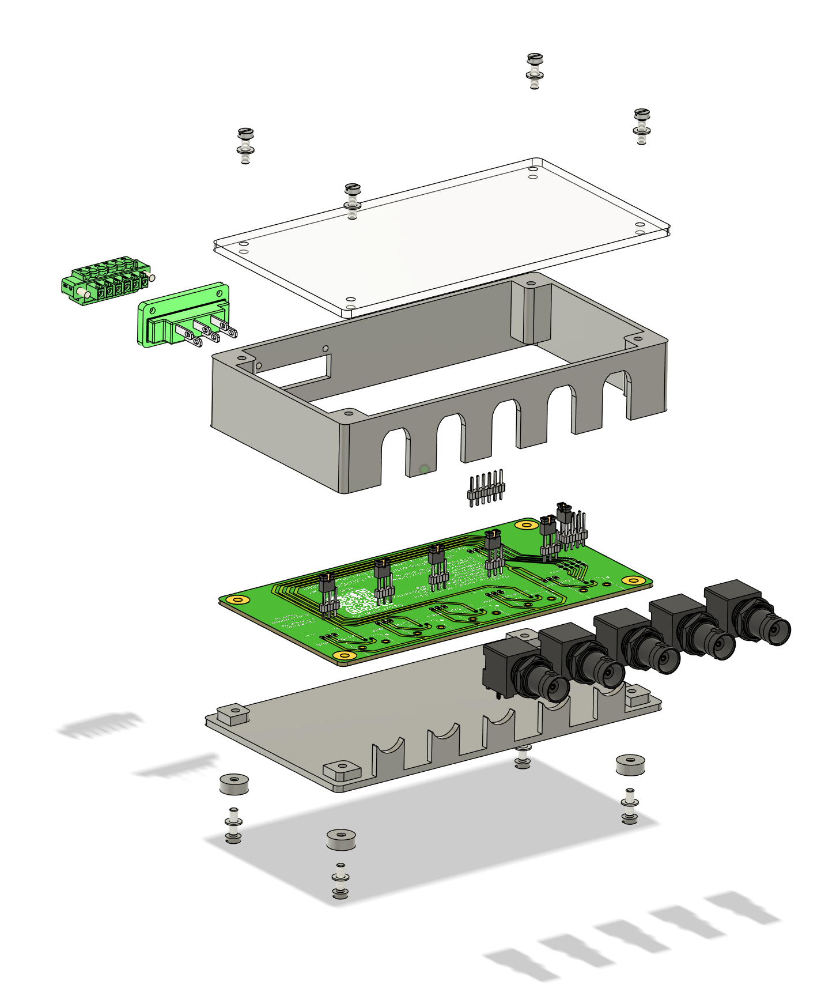

# BNC-ifier User Guide

The BNC-ifier (Figure 1) adds I/O BNC connectors to Basler cameras, enabling simple integration into experimental imaging and behavioral setups for neuroscience. The PCB is designed to be accessible for scientists, with thorough documentation for self-assembly. Its modular design and detailed instructions allow users to adapt the PCB for any of the supported Basler cameras. A list of supported cameras with connection instructions can be found [here](https://ibehave-cadre.github.io/BNC-ifier).  A full list of parts (Table 1) and manufacturing files are provided in this repository. The BNC-ifier can be used as a stackable device or mounted in 19-inch racks.

  
  

**Figure 1:** The BNC-ifier (left) and the accessible documentation with parts list, QR code for GitHub and contact details on the PCB (right).

Using this device allows synchronization of the Basler camera with microscopes, DAQs, sensors, and actuators via 5V TTL digital pulses (Figure 2). It also allows daisy-chaining Basler cameras via the sync port in order to synchronize frames between cameras. Additionally, one can grab time stamps from the sync port or one of the many BNC ports, depending on the I/O settings.

  

  **Figure 2:** Schematic of exemplary implementation of the BNC-ifier. Here, a 2P-Microscope frame frigger (e.g. from ScanImage) is connected to Line 1 to trigger individual frames of the Basler camera. At the same time, the sync port is connected to a DAQ for data logging and time stamps. The image of the Basler camera and I/O cable wasobtained and adapted from [baslerweb.com](https://www.baslerweb.com/).

## Assembly

For assembling the BNC-ifier, access to a 3D printer, a laser cutter, and a soldering station are recommended. The PCB can be obtained in the CADRE Maker Space or ordered via any online manufacturer for PCBs. The commercial parts can be ordered online if not available in the CADRE Maker Space. We also provide support for sourcing all the parts and keep them in stock if possible. All parts for the case can be 3D printed in the CADRE Maker Space or ordered via online 3D printing services.

  

**Figure 3:** Exploded view of the BNC-ifier for assembly instructions.

1. Assembling the PCB: All electronic parts have to be soldered to the top side of the PCB at the labeled positions. This includes the BNC connectors and all the male pin headers. Once all the parts are soldered, each pin terminal can be equipped with a jumper bridge. This jumper will later be used for the configuration of the BNC-ifier.

2. Preparing the Connector: The green Phoenix Contact connector has to be equipped with jumper cables. Therefore, jumper cables with female pin headers have to be soldered to the connector and finished with shrink tubing.

3. Preparing the Case: All parts of the case have to be 3D printed and laser cut. Once they are manufactured, they can be assembled with screws (Figure 3). The PCB goes in between the top and bottom parts of the case. The Phoenix Contact connector then needs to be attached to the hole, and the jumper cables need to be inserted.

5. Now the lid can be closed with the additional screws.

> [!NOTE]
> For the rack-mounted version (Figure 4), the lid needs to be closed after placing the BNC-ifier in the rack panel. Closing the lid will then secure the device in the panel.

  
  

**Figure 4:** BNC-ifier as a stack (left) and mounted in a rack panel (right).

## Configuration of the BNC-ifier

For connecting the Basler camera to the BNC-ifier, an I/O cable with the corresponding connector for the camera on one end and open pins on the other end must be available. This cable can be ordered on the Basler web page using the following [link](https://www.baslerweb.com/en/accessories/?accessory_type=I/O+/+Power+Cable#products). Normally, the cable comes with a small piece of paper providing the color code, cable pin layout, and numbering.

> [!TIP]
> If this document was lost or not provided, the color code and pin layout of the cable can be determined with a multimeter in continuity mode. Connecting the probes to a pin of the cable connector and an open wire end of the cable will make the multimeter beep if there is electrical continuity. The pairing of beeping pins and wire colors can then be noted down.

Depending on the camera model, each I/O line can be an opto-coupled or a GPIO line, while each type has its own ground pin. Therefore, the BNC-ifier grounding scheme has to be configured in order to provide each pin with the correct reference ground.

To find out which camera pin has to be connected to which BNC-ifier pin, please refer to this [site](https://ibehave-cadre.github.io/BNC-ifier). Clicking on the camera name will provide the pin type, pin layout, and pin number of each camera, along with an illustration and table. If this site does not work, please refer to the `cameras.csv` file and the `pin_numbering` folder in this repository.

The BNC-ifier can now be configured as follows:

1. Connect each camera pin to the corresponding pin of the Phoenix Contact connector screw terminal on the BNC-ifier box.
2. Unscrew the top of the BNC-ifier and open the lid.
3. Each jumper cable can now be connected to the corresponding line on the 6x male pin header terminal.
3. The jumper bridges on the 3x male pin headers can now be placed to select the corresponding ground (opto-coupled vs. GPIO) for Lines 1-4.

> [!TIP]
> If there is no ground (GND) for the line in the table, it does not matter how the pin header is set.

4. To configure the sync port, the jumper bridge can be placed to select one of the four lines on the 2x4 male pin header. This will allow output of any signal on the selected line to the sync BNC port in a bidirectional manner.
5. Place the lid back on the BNC-ifier and screw it on.

## Integration in Experimental Setups

The BNC-ifier can now be connected to other devices via coaxial BNC cables. Lines 1-4 can be configured in Pylon in order to start camera frames, provide information like exposure time or timestamps, and much more. The sync port can also be used for recording timestamps via a DAQ, but if connected to Lines 1-4 of another camera, it acts as a daisy-chaining port. The provided wiring diagram (Figure 5) and PCB layout (Figure 6) can help to understand the BNC-ifier and plan its setup integration.

## References and Contact Details

The BNC-ifier is used by the laboratories of Sabine Krabbe (DZNE, Bonn), Tobias Rose (IEECR, Bonn), Tobias Ackels (IEECR, Bonn), Ilona Grunwald-Kadow (Institute for Physiology, Bonn), and many more to come...

For any further questions, please contact the [CADRE Team](https://ibehave.nrw/ibots-platform/cadre/)

## Wiring Diagram

  

**Figure 5:** Schematics of electronics circuit of the BNC-fier.

## PCB Layout

  
  

**Figure 6:** PCB layout of the BNC-ifier from top (left) and bottom (right).

## Parts List

| Item | Quantity | Notes | Product Example Link |
| :--- | :---: | :---: | :---: |
|  |  |  |  |
| **Commercial Parts:** |
|  |  |  |  |
| Custom BNC-ifier PCB | 1 piece | [custom design](PCB) | [eurocircuits.com](https://www.eurocircuits.com/) |
| Phoenix Contact DFK-MC 1.5/ 6-GF-3.81 | 1 piece | |[rs-online.com](https://uk.rs-online.com/web/p/pluggable-terminal-blocks/1761449?gb=s)|
| Phoenix Contact MC 1.5/ 6-STF-3.81 | 1 piece ||[rs-online.com](https://uk.rs-online.com/web/p/pluggable-terminal-blocks/1703921?gb=s)|
| Amphenol RF BNC Connector 031-5431-10RFX | 5 pieces ||[rs-online.com](https://uk.rs-online.com/web/p/coaxial-connectors/1440890?gb=a)|
| Renkforce Jumper Cable JKFF403 | 6 pieces ||[rs-online.com](https://www.conrad.de/de/p/renkforce-jkff403-jumper-kabel-arduino-banana-pi-raspberry-pi-40x-drahtbruecken-buchse-40x-drahtbruecken-buchse-30-2299845.html)|
| Jumper Bridge | 6 pieces ||[rs-online.com](https://de.rs-online.com/web/p/jumper/7636776P?gb=s)|
| Male Pin Header | 29 pieces ||[rs-online.com](https://de.rs-online.com/web/p/leiterplatten-header/2518632?gb=s)|
| Shrink Tube | 16 pieces of 1.5 cm ||[rs-online.de](https://de.rs-online.com/web/p/warmeschrumpfschlauche/2833249?gb=s)|
| Screw M3x10 Flathead | 8 pieces | self-tapping|[mercateo.com](https://www.mercateo.com/p/1498C-8000152817/Flachkopfschraube_DIN_85_ISO_1580_Schlitz_M3x10_4_8_galv_verz_200St_.html?ViewName=live~secureMode)|
| Washer M3 | 8 pieces | |[mercateo.com](https://www.mercateo.com/p/4502-16H900/Unterlegscheibe_M3_H_0_5_mm_Aussen_7_mm_Stahl_verzinkt_DIN_125_ISO_7090_.html?ViewName=live~secureMode)|
|  |  |  |  |
| **Parts for Case:** |
|  |  |  |  |
| Case Frame Top | 1 piece | [custom design](Case/Case_Frame_Top.stl) | 3D printed |
| Case Frame Bottom | 1 piece | [custom design](Case/Case_Frame_Bottom.stl) | 3D printed |
|  |  |  |  |
| **Parts for Stacking Case:** |
|  |  |  |  |
| Top Lid Stackable | 1 piece | [custom design](Case/Top_Lid_Stackable.stl) | lasercut, can be printed |
| Stacking Feet | 4 pieces | [custom design](Case/Stacking_Feet.stl) | 3D printed |
|  |  |  |  |
| **Parts for Rack Mounting Case:** |
|  |  |  |  |
| Rack Mounting Case Top Back | 1 piece | [custom design](Case/Rack_Mounting_Case_Top_Back.stl) | 3D printed |
| Rack Mounting Case Top Front | 1 piece | [custom design](Case/Rack_Mounting_Case_Top_Front.stl) | 3D printed |
| Rack Panel | 1 piece | [custom design](Case/Rack_Panel.stl) | lasercut |

**Table 1:** Parts list for building BNC-fier either as stackable device or for mounting in a 19 inch rack.
