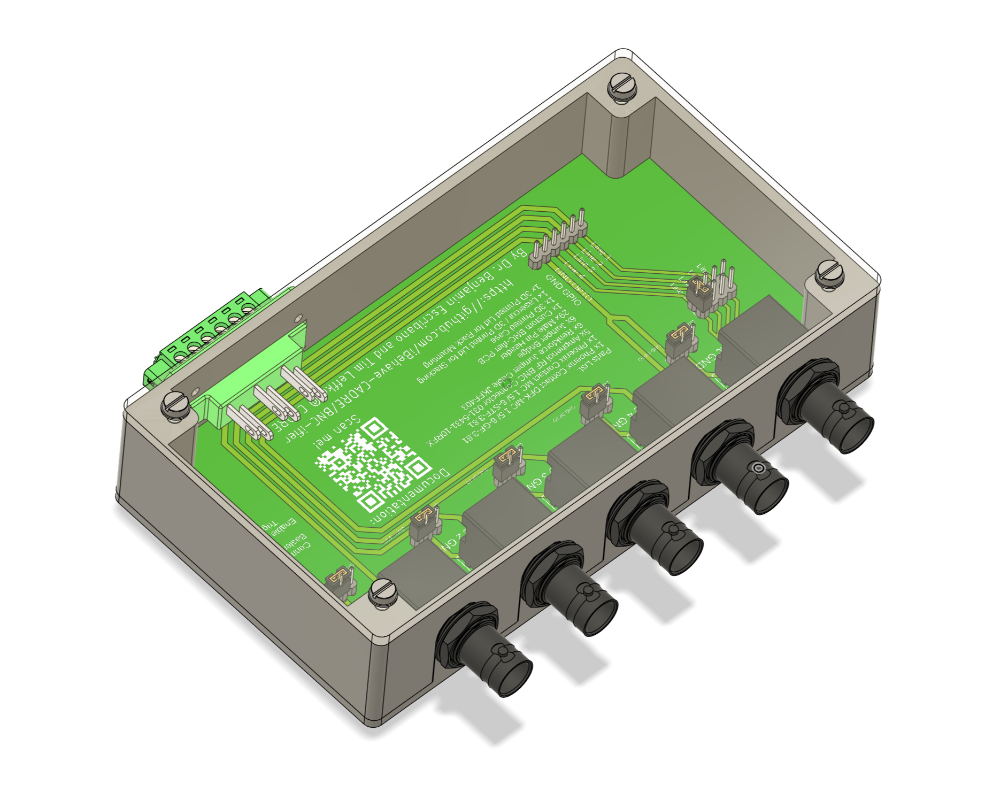
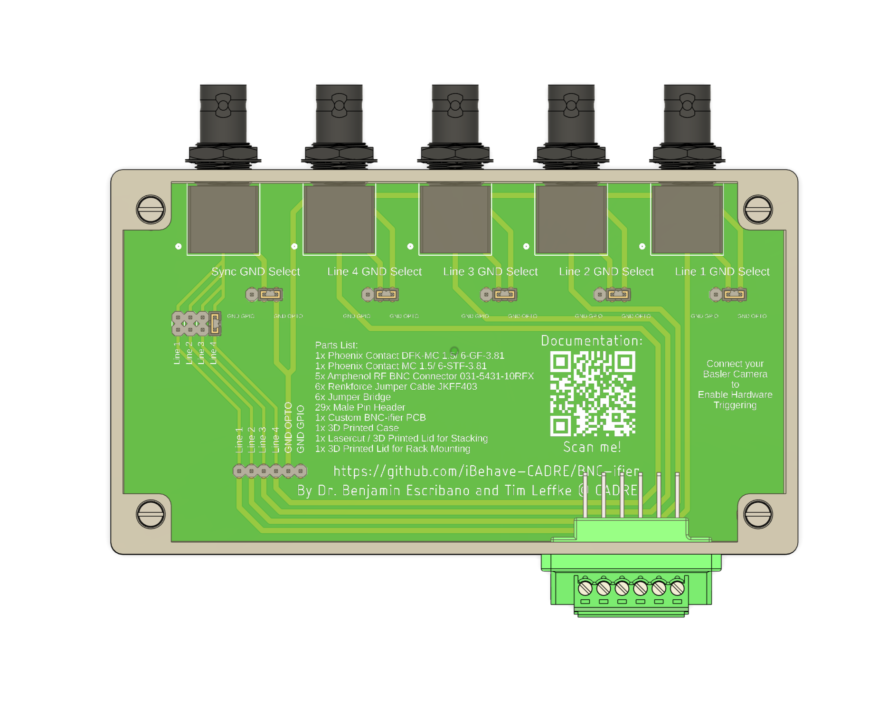
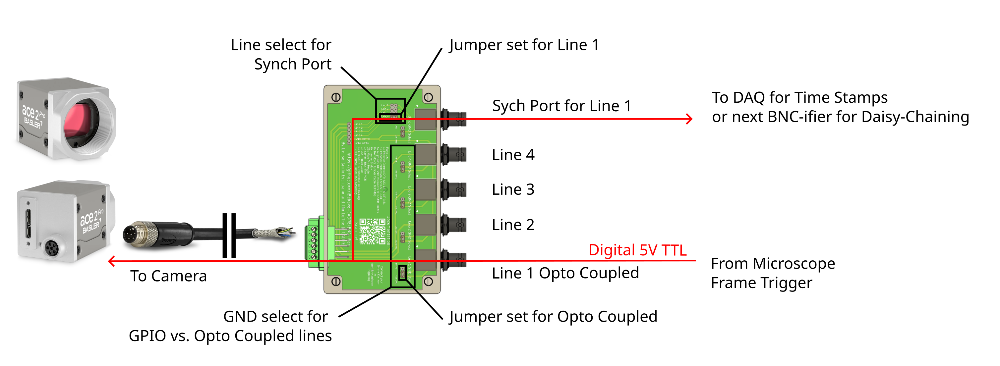
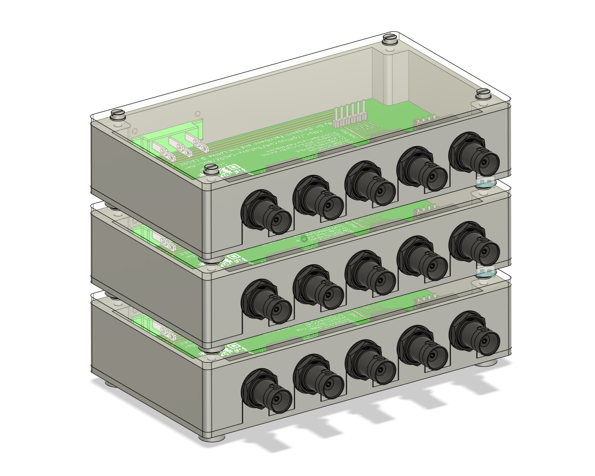
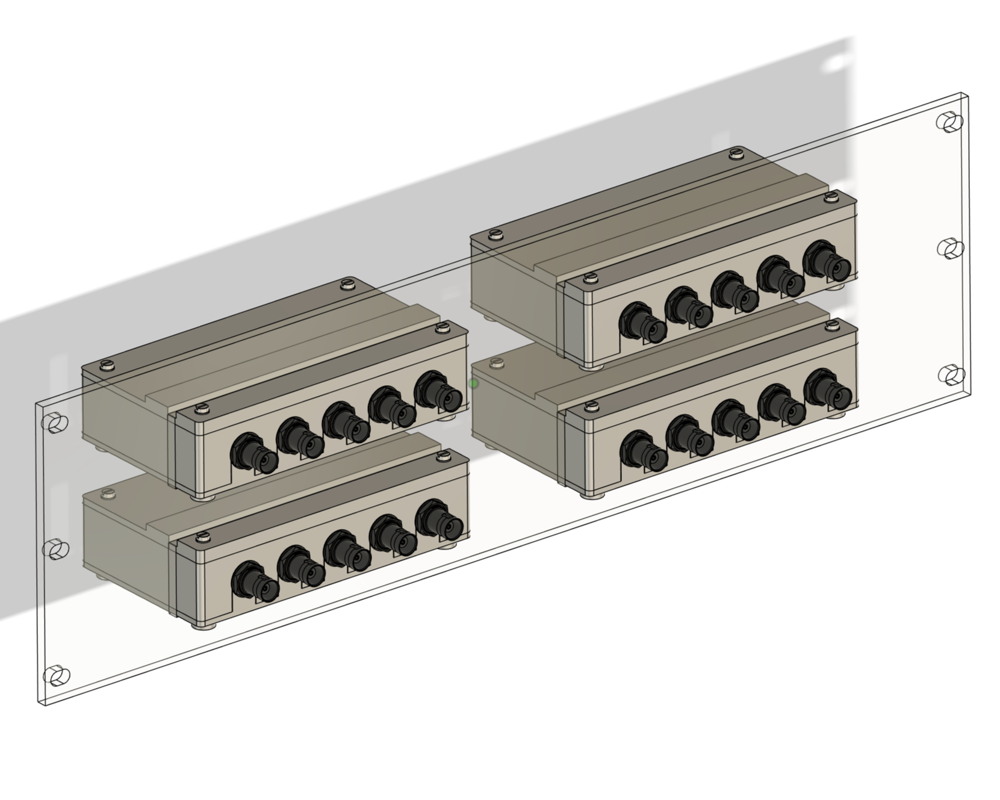
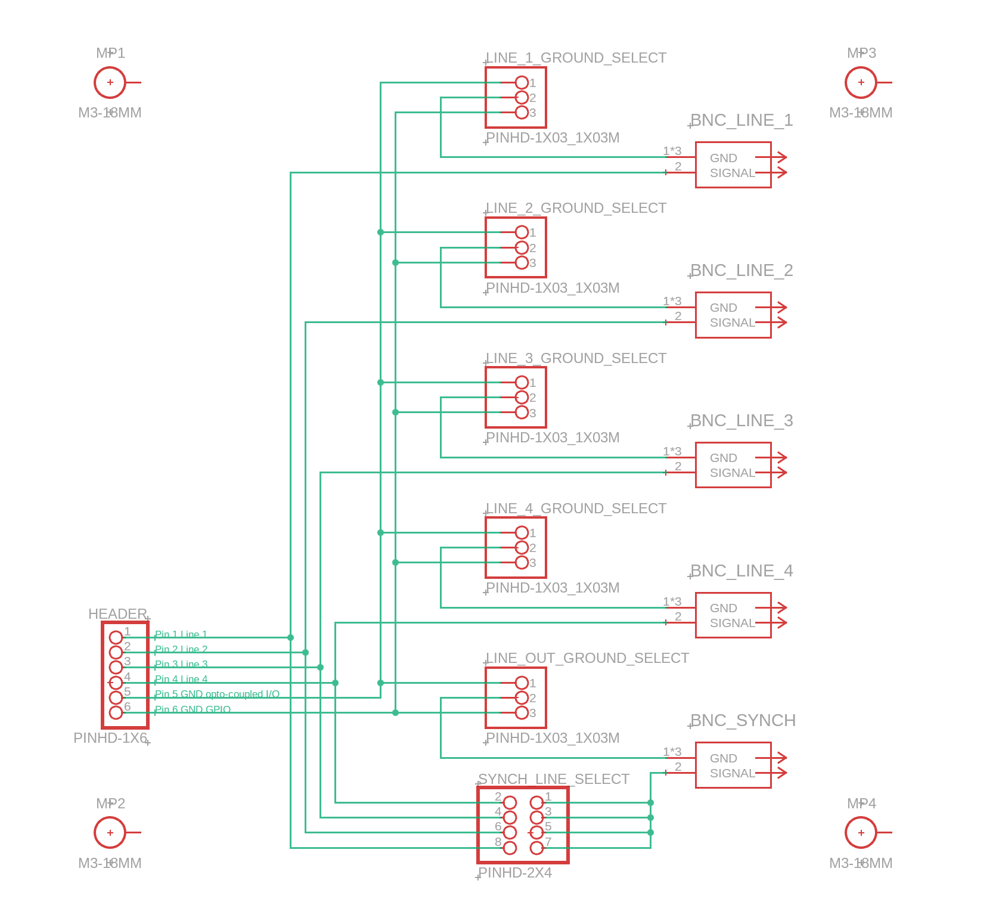
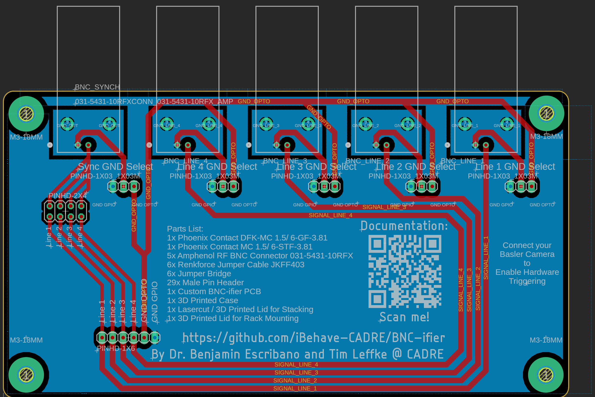
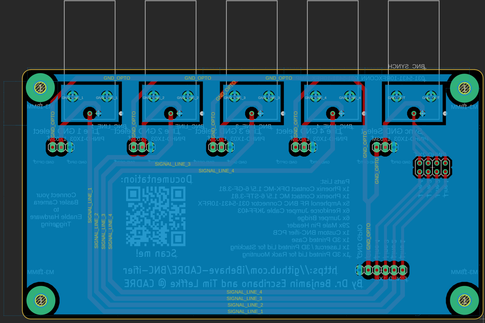

# BNC-ifier User Guide

The BNC-ifier adds BNC connectors to Basler cameras, enabling simple integration into experimental imaging and behavioral setups for neuroscience. The PCB is designed to be accessible for scientists, with thorough documentation for self-assembly. Its modular design and detailed instructions allow users to adapt the PCB for any of the supported Basler cameras. A list of supported cameras with connection instructions can be found [here](https://ibehave-cadre.github.io/BNC-ifier). The BNC-fier can be used as a stackable device or mounted in 19 inch racks.

  
  

**Figure 1:** The BNC-ifier (left) and the accessible documentation with partslist, QR code for GitHub and contact details on the PCB (right).

Using this device allows to synchronize the Basler camera with microscopes, DAQs, sensors and actuators via 5V digital pulses. It also allows to daisy-chain basler cameras via the synch port. in order to synchroniye frames between cameras. Also one can grab time stamps from the synch port or one of the many BNC ports, depending on the IO settings.

  

**Figure 2:** Schematic of exemplary implementation of the BNC-ifier. Here, a 2p-Microscope Frame Trigger is connected to Line 1 to trigger individual frames of the Basler Camera. At the same time, the Sych Port is connected to a DAQ for data logging and time stamps.

- ToDo:
image of device, stack and rack
image with scheme of connection to pc and bnc
assembly instructions

## Assembly

For assembling the BNC-fier access to a 3D printer, a lasercutter and a soldering station are recomended. The PCB can be obtained in the CADRE Maker Space or ordered via any online manufacturer for PCBs. The commercial parts can be ordered online if not available in the CADRE Maker Space. We also provide support for sourcing all the parts and keep them on stock if possible.

All electronics parts have to be soldered to the top side of the PCB at the labelled position. The green Phoenix Contact connector has to be soldered to female jumper cables and finished with a shrink tube.

Printing cutting, assemlbly adding jumper bridges and cable connections.

Closing the lid and rack mounting

  
  

**Figure 2:** BNC-ifier as Stack (left) and mounted in a rack panel (right).

### Parts List

| Item | Quantity | Notes | Product Example Link |
| :--- | :---: | :---: | :---: |
|  |  |  |  |
| **Commercial Parts:** |
|  |  |  |  |
| Custom BNC-ifier PCB | 1 piece | [custom design](PCB) | [eurocircuits.com](https://www.eurocircuits.com/) |
| Phoenix Contact DFK-MC 1.5/ 6-GF-3.81 | 1 piece | |[rs-online.com](https://uk.rs-online.com/web/p/pluggable-terminal-blocks/1761449?gb=s)|
| Phoenix Contact MC 1.5/ 6-STF-3.81 | 1 piece ||[rs-online.com](https://uk.rs-online.com/web/p/pluggable-terminal-blocks/1703921?gb=s)|
| Amphenol RF BNC Connector 031-5431-10RFX | 5 pieces ||[rs-online.com](https://uk.rs-online.com/web/p/coaxial-connectors/1440890?gb=a)|
| Renkforce Jumper Cable JKFF403 | 6 pieces ||[rs-online.com](https://www.conrad.de/de/p/renkforce-jkff403-jumper-kabel-arduino-banana-pi-raspberry-pi-40x-drahtbruecken-buchse-40x-drahtbruecken-buchse-30-2299845.html)|
| Jumper Bridge | 6 pieces ||[rs-online.com](https://de.rs-online.com/web/p/jumper/7636776P?gb=s)|
| Male Pin Header | 29 pieces ||[rs-online.com](https://de.rs-online.com/web/p/leiterplatten-header/2518632?gb=s)|
| Shrink Tube | 16 pieces of 1.5 cm ||[rs-online.de](https://de.rs-online.com/web/p/warmeschrumpfschlauche/2833249?gb=s)|
| Screw M3x10 Flathead | 8 pieces | self-tapping|[mercateo.com](https://www.mercateo.com/p/1498C-8000152817/Flachkopfschraube_DIN_85_ISO_1580_Schlitz_M3x10_4_8_galv_verz_200St_.html?ViewName=live~secureMode)|
| Washer M3 | 8 pieces | |[mercateo.com](https://www.mercateo.com/p/4502-16H900/Unterlegscheibe_M3_H_0_5_mm_Aussen_7_mm_Stahl_verzinkt_DIN_125_ISO_7090_.html?ViewName=live~secureMode)|
|  |  |  |  |
| **Parts for Case:** |
|  |  |  |  |
| Case Frame Top | 1 piece | [custom design](Case/Case_Frame_Top.stl) | 3D printed |
| Case Frame Bottom | 1 piece | [custom design](Case/Case_Frame_Bottom.stl) | 3D printed |
|  |  |  |  |
| **Parts for Stacking Case:** |
|  |  |  |  |
| Top Lid Stackable | 1 piece | [custom design](Case/Top_Lid_Stackable.stl) | lasercut, can be printed |
| Stacking Feet | 4 pieces | [custom design](Case/Stacking_Feet.stl) | 3D printed |
|  |  |  |  |
| **Parts for Rack Mounting Case:** |
|  |  |  |  |
| Rack Mounting Case Top Back | 1 piece | [custom design](Case/Rack_Mounting_Case_Top_Back.stl) | 3D printed |
| Rack Mounting Case Top Front | 1 piece | [custom design](Case/Rack_Mounting_Case_Top_Front.stl) | 3D printed |
| Rack Panel | 1 piece | [custom design](Case/Rack_Panel.stl) | lasercut |

**Table 1:** Parts list for building BNC-fier either as stackable device or for mounting in a 19 inch rack.

## Usage

To connect your Basler camera to the BNC-ifier you should have a I/O cable with the corresponding connector of your camera on one end and open pins on the other end. This cable can be ordered on the Basler web page: [I/O Cables](https://www.baslerweb.com/en/accessories/?accessory_type=I/O+/+Power+Cable#products).
If you do not know which of the open pins refer to which of the pins of the camera connector, please refer to this [section](#finding-out-the-connections-of-the-cable).

You can find the pin numbering of your camera by going to the image your camera in the pin_numbering folder.
To find out which Camera pin has to be connect to which Bnc-ifier pin please refer to this [site](https://ibehave-cadre.github.io/BNC-ifier). You can also find out which how the camera pins are numbered there.
If this site does not work, please refer to the `cameras.csv` file in this repository.

1. Connect the camera pin to the corresponding pin of the BNC-ifier Box.
2. Unscrew the top of the BNC-ifier and open the lid.
3. You can see multiple pin headers. There is a pin header for each line. It selects what ground to use for the pin. Please set them to the corresponding ground found in the table for each line.
> [!TIP]
> If there is no ground (GND) for the line in the table it does not matter how the pin header is set.
4. If you want to connect more cameras to a trigger signal you can select which line gets send to the output of the BNC-ifier via the pin header at the output. Please also select the corresponding ground. It should be the same as the line you selected.
5. Place the lid back on the BNC-ifier and screw it on.

## Finding out the connections of the cable

> [!NOTE]
> Your cable should have come with some documentation to tell you, which color corresponds to which pin.

To find which pins of the connector correspond to which open pin on the other end of the cable you will need to have a multimeter.

1. Set the multimeter to Continuity Mode. It should beep when you touch the probes together.
2. Connect one of the probes to the first pin. With the other probe touch each of the open pins until you hear the multimeter beep. Write down the which color corresponds to the pin number.
3. Repeat for all pins.

> [!TIP]
> Some pins might be unconnected.

## Integration

Once connected, BNC cables can be connected to other devices. 5V TTL pulses IO for starting, frame triggering, synch and timestamps.

Wiring Diagram
--------------------

  

**Figure 3:** Schematics of electronics circuit of the BNC-fier.

PCB Layout
--------------------

  
  

**Figure 4:** PCB layout of the BNC-ifier from top (left) and bottom (right).

## References

The BNC-ifier is used by the Laboratories of Sabine Krabbe (DZNE, Bonn), Tobias Rose (IEECR, Bonn), Tobias Ackels (IEECR, Bonn), Ilona Grunwald-Kadow (Institute for Physiology, Bonn) and many more to come...

For any further questions please contact the [CADRE Team](https://ibehave.nrw/ibots-platform/cadre/)